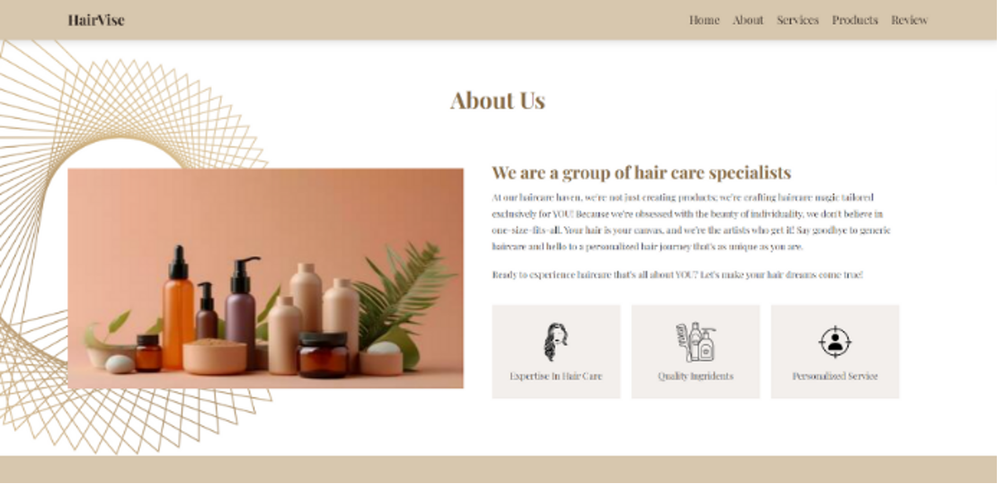
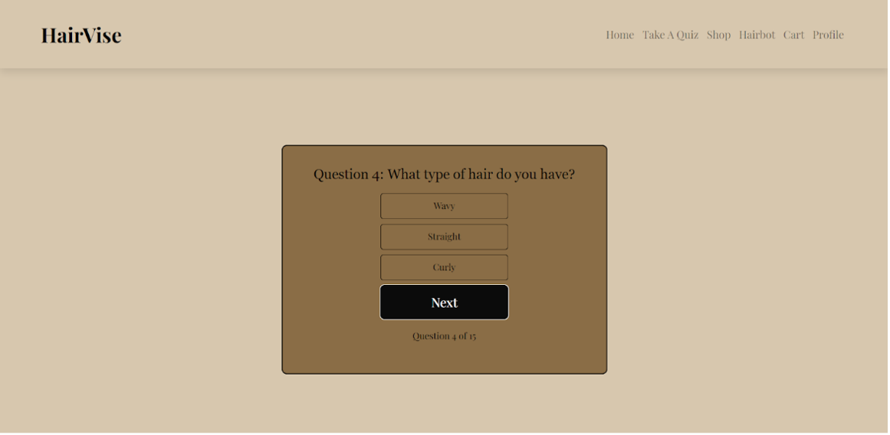
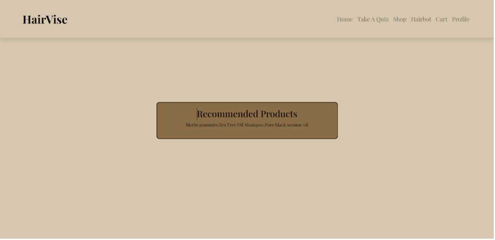
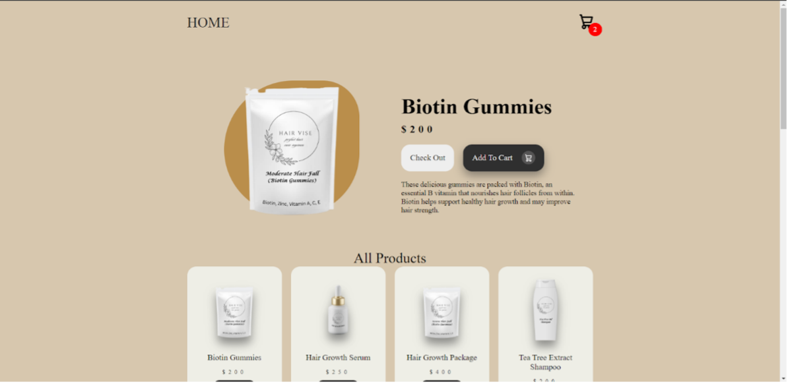
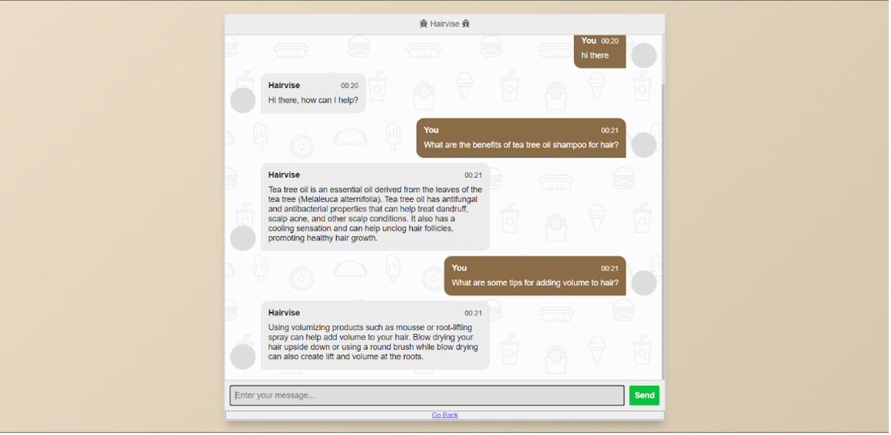

# HairVise — Questionnaire-Based Hair Care Product Classification System

## 📌 Project Overview
HairVise is an **AI-powered questionnaire-based recommendation system** that suggests **personalized hair-care product categories** for common concerns:
- Hair Loss
- Dandruff
- Hair Greying

Users answer a short set of questions, and the system predicts the **most suitable product category** for the selected concern.  
This project is designed as a **first-stage personalization engine**, not a medical diagnosis tool.

## 🗂️ Data
- Structured questionnaire responses
- Three independent datasets:
  - **Hair Loss:** ~6,000 responses
  - **Dandruff:** ~5,200 responses
  - **Hair Greying:** ~4,800 responses
- Each dataset:
  - 6 categorical input features + AgeGroup
  - 1 multi-class target (product category)
- Duplicate rows retained intentionally to preserve **real user frequency patterns**

## 🧠 Modeling Approach
- Problem type: **Supervised multi-class classification**
- Three separate models (one per hair concern) for clarity and interpretability
- Preprocessing:
  - One-Hot Encoding for categorical features
  - Stratified train–test split
  - Class weighting applied for greying (imbalanced data)

## 🤖 Models Evaluated
- Logistic Regression (baseline)
- Random Forest
- **XGBoost (Final Model)**

**XGBoost consistently achieved the highest Macro F1 scores** by capturing non-linear interactions between age, severity, duration, and habits.

## 📊 Results (Approx.)
- **Hair Loss:** Macro F1 ≈ 0.90  
- **Dandruff:** Macro F1 ≈ 0.89  
- **Hair Greying:** Macro F1 ≈ 0.87 (with class weighting)

Macro F1 was prioritized over accuracy to ensure fair performance across product categories.

## 🚀 Deployment
- Models deployed behind a **Flask API**
- Frontend questionnaire submits responses
- API returns predicted product category instantly
- Designed to integrate into a consumer hair-care platform
 

## 🛠️ Tech Stack
- **Programming Languages:** Python, JavaScript  
- **Frontend:** React  
- **Backend / API:** Python (Flask)  
- **Machine Learning:** Scikit-learn, XGBoost  
- **Data Handling:** Pandas, NumPy  

## 📌 Key Takeaway
HairVise demonstrates an **end-to-end ML pipeline** for questionnaire-driven personalization, covering **data design, modeling, evaluation, and deployment** using practical, production-ready machine learning techniques.

## Project Images

  
  
  

  
  
  

